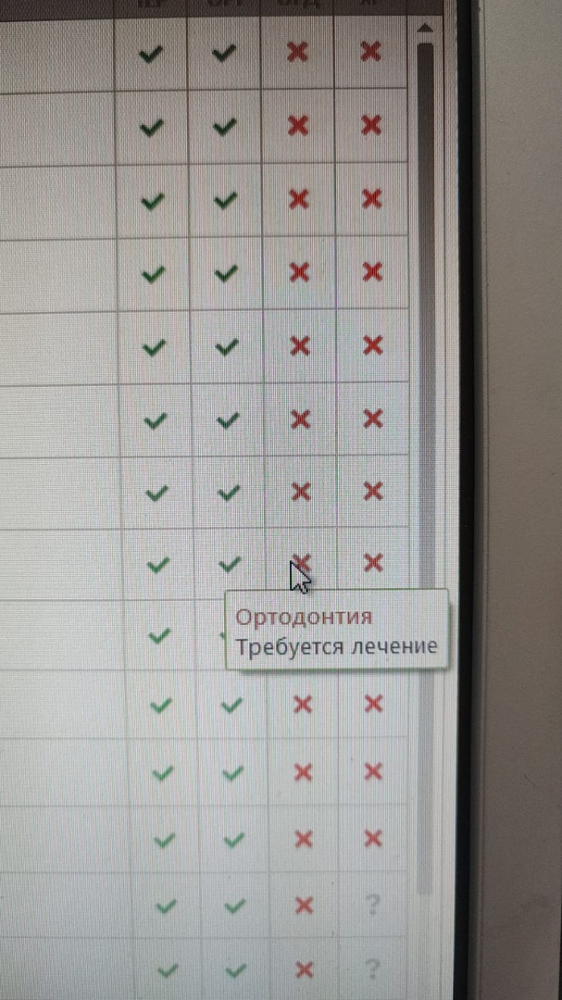
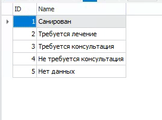

# Описание
    Требуется определить пациентов, которым, после оказанной услуги, по рекомендации врача, требуется лечение в каком-то из отделений указанным врачом. 
    В IDENT отделения фиксированы и представлены следующими видами: Терапия, Ортодонтия, Ортопедия, Хирургия и Пародонтия.
    По желанию клиники, какие-то отделения могут быть отключены в МИС. 
    На рисунке ниже пример, как выглядят рекомендации лечения в отделения.



    Галочками отмечаются пациенты, которым не требуется рекомендация.
    Крестиками отмечаются пациенты, которым и требуется и не требуется рекомендация. Список того что попадает под крестик можно увидеть на рисунке ниже


    1. Галочка
    2. Крестик
    3. Крестик
    4. Крестик
    5. Крестик

    Так как крестики могут ставится в разных случаях. Рекомендуется уточнить у клиники, какие типы она хотела бы считать за рекомендацию к лечению в отделении. На основании выбора этих крестиков вам нужно будет сформировать SQL скрипт, шаблон которого представлен ниже. Где <X> список идентификаторов крестиков, через запятую. Например: 2,3 или 2 или 3. 


# Изменения в Zabota
## 1. Добавить SQL скрипт
#### _custom_treatments_suggestions.ns
```SQL
SELECT 
	os.ID  		  AS treatment_id,
	1		  AS treatment_department_id
FROM  
	orderservicerelation os
INNER JOIN 
      orders o ON o.ID = os.ID_Orders
WHERE
	o.ID_TherapeuticSanations IN (<X>)

UNION

SELECT 
	os.ID  		  AS treatment_id,
	2		  AS treatment_department_id
FROM  
	orderservicerelation os
INNER JOIN 
      orders o ON o.ID = os.ID_Orders
WHERE
	o.ID_ProstheticSanations IN (<X>)

UNION

SELECT 
	os.ID  		  AS treatment_id,
	3		  AS treatment_department_id
FROM  
	orderservicerelation os
INNER JOIN 
      orders o ON o.ID = os.ID_Orders
WHERE
	o.ID_OrthodonticSanations IN (<X>)

UNION

SELECT 
	os.ID  		  AS treatment_id,
	4		  AS treatment_department_id
FROM  
	orderservicerelation os
INNER JOIN 
      orders o ON o.ID = os.ID_Orders
WHERE
	o.ID_ParodontolalSanations IN (<X>)

UNION

SELECT 
	os.ID  		  AS treatment_id,
	16		  AS treatment_department_id
FROM  
	orderservicerelation os
INNER JOIN 
      orders o ON o.ID = os.ID_Orders
WHERE
	o.ID_SurgicalSanations IN (<X>)
```
      

## 2. Создать таблицу _custom_treatments_departments
Таблица используется только как справочник. Данные в ней фиксируются и больше не изменяются никогда
                    
Столбец  | Тип  |   Описание
------------- | -------------   |   -------------
department_id | int |   Идентификатор отделения
name  |   varchar(50) |   Название отделения
----

## 3. Создать таблицу _custom_treatments_suggestions и смежную таблицу _custom_treatments_suggestions_tmp
Таблицы хранят информацию о связи услуги и рекомендации пациенту о походе в отделение из списка таблицы выше
                    
Столбец  | Тип  |   Описание
------------- | -------------   |   -------------
treatment_id  | int |   Идентификатор услуги (patients_treatment)
treatment_department_id  |   int |   Идентификатор рекомендации в отделение
----


## 4. Выполнить 

```SQL
CREATE TABLE dbo._custom_treatments_departments (
  department_id INT NULL,
  name VARCHAR(50) COLLATE Cyrillic_General_CI_AS NULL
) ON [PRIMARY]
GO

INSERT dbo._custom_treatments_departments VALUES (1, N'Терпапия')
INSERT dbo._custom_treatments_departments VALUES (2, N'Ортопедия')
INSERT dbo._custom_treatments_departments VALUES (3, N'Ортодонтия')
INSERT dbo._custom_treatments_departments VALUES (4, N'Пародонтия')
INSERT dbo._custom_treatments_departments VALUES (16, N'Хирургия')
GO

CREATE TABLE dbo._custom_treatments_suggestions (
  treatment_id INT NULL,
  treatment_department_id INT NULL
) ON [PRIMARY]
GO

CREATE TABLE dbo._custom_treatments_suggestions_tmp (
  treatment_id INT NULL,
  treatment_department_id INT NULL
) ON [PRIMARY]
GO
```

## 5.  Добавить в хранимую процедуру spReplaceAll следующие строки
```SQL
    .............................................
    DELETE FROM _custom_treatments_suggestions;
    .............................................
    .............................................
    .............................................

    INSERT INTO _custom_treatments_suggestions (treatment_id, treatment_department_id)
    SELECT treatment_id, treatment_department_id FROM _custom_treatments_suggestions_tmp;
```

## 6. Добавить поле treatment_id в INSERT INTO patients_treatment в процедуре spReplaceAll. Пример изменения. 
```diff
- Обратите внимание! Это пример, вам нужно добавить только treatment_id. Необдуманная замена, может привести к поломке хранимой процедуры!
- Если в вашем коде нет строки SET IDENTITY_INSERT patients_treatment ON; - добавьте и ON и OFF
```

```SQL
    .............................................
    .............................................
    .............................................

    SET IDENTITY_INSERT patients_treatment ON;
    insert into patients_treatment (treatment_id,Patient_id,treatment_date,Total,Pay_or_not,Doctor_ID,Procedure_id,cust_id) 
    select treatment_id,Patient_id,treatment_date,Total,COALESCE(Pay_or_not,0),Doctor_ID,Procedure_id,ISNULL(Cust_ID,1) 
    FROM patients_treatment_tmp tmp;
    SET IDENTITY_INSERT patients_treatment OFF;
    .............................................
    .............................................
    .............................................   
```

## Пример поиска пациентов, которым поставили сегодня отметку - требуется лечение в хирургии

```SQL
SELECT 
    *
FROM
    vpatients v
INNER JOIN
    patients_treatment t ON t.patient_id = v.patient_id
INNER JOIN
    _custom_treatments_suggestions s ON s.treatment_id = t.treatment_id
WHERE
    DATEDIFF(DAY,GETDATE(),t.treatment_date) = 0
AND
    s.department_id = 16
```